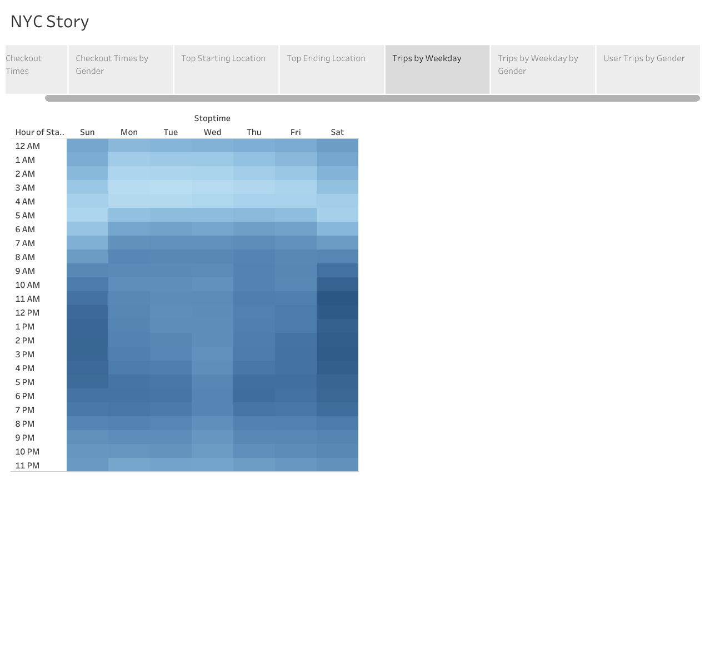

# bikesharing

## Overview

We were asked to complete an analsys to convince investors to invest into expanding the Bike Share program.

https://public.tableau.com/app/profile/karen.mashburn/viz/NYCRides/Story1

## Results

There is a description of the results for each visualization (7 pt)

## Summary

I think that expanding to an new market would be benifical based on the analyzed data.  
There is a high-level summary of the results and two additional visualizations are suggested for future analysis (5 pt)
